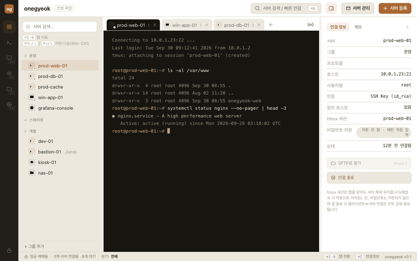

# onegyeok

**SSH · RDP · VNC · SFTP · Web — 흩어진 원격 접속 클라이언트를 하나로.**
서버/인프라 엔지니어를 위한 올인원 원격 접속 데스크톱 앱입니다. 사내 ISMS 인증 심사를 염두에 두고
설계되어, 비밀번호는 어디에도 저장하지 않고 접속할 때마다 터미널 안에서 직접 입력합니다.



> 위 데모는 로컬 SSH 서버에 실제로 접속하는 화면입니다 — 서버 등록 → 터미널 안에서 비밀번호 직접
> 입력 → tmux 세션 자동 attach → 여러 서버 동시 입력(브로드캐스트) 모드까지 실제 동작 그대로입니다.


%20in%20progress-orange?style=flat-square)

---

## 왜 onegyeok인가

인프라 엔지니어는 하루에도 SSH(+tmux), RDP, VNC, SFTP 클라이언트를 번갈아 켭니다. 보통 이 조합은
Termius, Royal TSX, FileZilla Pro처럼 각각 유료 프로그램으로 따로 씁니다. onegyeok은 이걸 한 앱에서
**서버 등록 한 번으로 프로토콜에 맞게 바로 연결**되게 합니다.

- **비밀번호 자동 저장 없음** — ISMS 심사 시 심사위원 앞에서 비밀번호를 직접 입력해야 한다는 요구사항을
  반영해, 애초에 비밀번호/Key Passphrase를 어디에도 저장하지 않습니다. 접속할 때마다 터미널 안에
  `user@host's password:` 프롬프트가 뜨고 그 자리에서 직접 타이핑합니다 — 일반 `ssh` 커맨드라인과
  동일한 경험입니다.
- **여러 서버 동시 입력(브로드캐스트)** — tmux `synchronize-panes`, Termius Multi Exec와 같은 개념.
  여러 서버에 접속 프롬프트를 띄워놓고 비밀번호를 한 번만 입력하면 선택된 모든 서버에 동시에 들어갑니다.
  접속 이후의 일반 명령도 동일하게 동시 전송됩니다.
- **tmux 세션 자동 유지** — 접속 성공 시 지정한 이름으로 `tmux new -A -s <name>`을 자동 전송합니다.
  탭을 닫아도 서버 측 세션은 유지되어 재접속 시 그대로 이어집니다.
- **앱 종료 시 모든 연결 강제 종료** — 보안 요구사항(F-502). 프로토콜 필터·탭 전환 중에는 연결이
  끊기지 않지만, 앱을 종료하면 열려 있던 모든 세션이 예외 없이 끊깁니다.

자세한 배경은 [기획서.md](./기획서.md) 참고.

---

## 실행 화면 둘러보기

| 서버 트리 + 탭 터미널 | 터미널 안에서 바로 입력하는 비밀번호 |
|---|---|
| 왼쪽 사이드바에서 서버를 클릭하면 새 탭으로 바로 연결 시도가 시작됩니다. 탭이 많아지면 좌우 화살표로 스크롤됩니다. | 별도 팝업 없이, 실제 `ssh` 명령어를 칠 때처럼 터미널 안에 프롬프트가 뜨고 그 자리에서 입력합니다. |

| 동시 입력(브로드캐스트) 모드 | 서버 관리 / 메모 |
|---|---|
| 토글 한 번으로 열려 있는 모든 SSH 서버에 같은 키 입력이 전송됩니다 — 비밀번호 입력 단계부터 적용됩니다. | 등록된 서버를 테이블에서 검색·정렬·일괄 편집할 수 있고, 서버별로 배포 체크리스트 같은 메모를 남길 수 있습니다. |

---

## 설치 및 실행

> ⚠️ 아직 더블클릭으로 설치하는 `.dmg`/`.exe` 패키지는 준비 중입니다(`electron-builder` 적용 예정 —
> [기술스택_명세서.md](./기술스택_명세서.md) 6장 참고). 지금은 **소스에서 직접 실행**합니다.

### 공통 준비물

- [Node.js](https://nodejs.org/) 18 이상 (LTS 권장)
- [Git](https://git-scm.com/)

설치 여부 확인:

```bash
node -v
git --version
```

### macOS

```bash
# 1. Node.js가 없다면 Homebrew로 설치
brew install node

# 2. 저장소 클론 후 의존성 설치
git clone https://github.com/minaridat/onegyeok.git
cd onegyeok
npm install

# 3. 실행
npm start
```

### Windows

1. [nodejs.org](https://nodejs.org/)에서 LTS 버전 설치 프로그램을 받아 설치합니다 (설치 중 "Add to PATH" 체크).
2. [git-scm.com](https://git-scm.com/)에서 Git을 설치합니다.
3. PowerShell(또는 명령 프롬프트)을 열고:

```powershell
git clone https://github.com/minaridat/onegyeok.git
cd onegyeok
npm install
npm start
```

`npm start`를 실행하면 onegyeok 데스크톱 창이 뜹니다. SSH 접속 기능(`ssh2`)은 순수 JS/옵셔널 네이티브
모듈 구조라 별도 빌드 도구 없이 바로 동작합니다.

> macOS에서는 직접 실행/검증을 마쳤습니다. Windows는 Electron·Node.js 기준으로는 동일하게 동작해야
> 하지만, 이 프로젝트에서 아직 Windows 환경에 대한 수동 검증은 진행하지 못했습니다 — 문제가 있다면
> 이슈로 알려주세요.

---

## 사용법

### 1. 서버 등록

상단의 **[+ 서버 등록]** 버튼 → 이름/그룹/프로토콜/호스트/포트/사용자명/인증 방식을 입력하고 저장합니다.
비밀번호 입력란은 없습니다 — 저장하지 않기 때문입니다. SSH Key 인증을 선택하면 키 **파일 경로**만
등록하고(파일 자체는 비밀이 아니므로), Passphrase는 접속 시점에 입력합니다.

### 2. 접속하기

왼쪽 사이드바에서 서버를 클릭하면 새 탭이 열리고, 터미널 안에 바로 인증 프롬프트가 뜹니다.

- 비밀번호 인증: `user@host's password:` → 타이핑 후 Enter
- Key 인증: `Enter passphrase for key '...':` → 패스프레이즈 없으면 그냥 Enter

접속에 성공하면 등록 시 지정한 tmux 세션 이름으로 자동 attach됩니다.

### 3. 여러 서버에 동시 입력하기

탭바의 브로드캐스트 아이콘(⊙)을 누르면, **현재 열려 있는 모든 SSH 탭**이 자동으로 그룹이 되고 상단에
경고 배너가 뜹니다. 이 상태에서 타이핑하면 (비밀번호 프롬프트든 일반 명령이든) 그룹의 모든 서버에
동시에 전송됩니다. 다시 누르면 꺼집니다.

> 현재 v1은 "열린 모든 SSH 탭 = 그룹" 방식입니다. 특정 탭만 골라 묶는 체크박스 선택이나, 여러 터미널을
> 동시에 화면에 띄우는 타일 뷰는 다음 단계로 예정되어 있습니다.

### 4. 서버 관리 / 메모

상단 **[서버 관리]** 에서 등록된 서버 전체를 테이블로 검색·정렬·일괄 삭제·그룹 이동할 수 있습니다.
오른쪽 "연결 정보" 패널의 **메모** 탭에는 서버별로 배포 명령어나 체크리스트 같은 메모를 남길 수 있고,
OS 자격증명 저장소 기반으로 암호화되어 저장됩니다(민감정보 입력은 권장하지 않습니다).

### 단축키

| 동작 | macOS | Windows |
|---|---|---|
| 번호로 탭 이동 | `⌘1`–`⌘9` | `Ctrl+1`–`Ctrl+9` |
| 이전/다음 탭 | `⌘⌥←` / `⌘⌥→`, `⌘<` / `⌘>` | `Ctrl+Tab`, `Ctrl+<` / `Ctrl+>` |
| 서버 검색 / 빠른 연결 | `⌘K` | `Ctrl+K` |
| 연결 정보 패널 토글 | `⌘I` | `Ctrl+I` |

사이드바·연결정보 패널은 경계선을 드래그해 폭을 조절할 수 있고, 끝까지 밀면 접힙니다.

---

## 보안 설계 요약

- 비밀번호·Key Passphrase는 **어떤 형태로도 저장하지 않습니다** — 연결 1회에만 메모리에서 사용되고 폐기됩니다.
- 서버별 메모는 OS 자격증명 저장소(macOS Keychain / Windows DPAPI) 기반의 Electron `safeStorage`로 암호화해 저장합니다.
- 앱 종료(정상/강제 포함) 시 열려 있는 모든 SSH 연결이 예외 없이 종료됩니다. 서버 측 tmux 세션은 유지됩니다.
- 상세 설계는 [기획서.md](./기획서.md) 3.9절, [Phase1_기능명세서.md](./Phase1_기능명세서.md) 3.5절 참고.

---

## 개발 문서

| 문서 | 내용 |
|---|---|
| [기획서.md](./기획서.md) | 전체 기획, 문제 정의, 로드맵, 보안 요구사항 |
| [Phase1_기능명세서.md](./Phase1_기능명세서.md) | Phase 1(서버 등록 + SSH) 상세 기능 명세, 구현 상태 |
| [Phase2-5_기능명세서.md](./Phase2-5_기능명세서.md) | SFTP/FTP · tmux 고도화 · RDP · VNC · Web 콘솔 명세 |
| [기술스택_명세서.md](./기술스택_명세서.md) | 라이브러리 선택 근거, 보안 스택, 프로젝트 구조 |

## 개발자용 실행

```bash
npm install
npm start
```

`src/renderer/`가 UI(서버 트리·탭·터미널·서버 관리), `src/main/`이 Electron 메인 프로세스(SSH 연결
관리·IPC), `src/preload/`가 렌더러에 노출하는 API 화이트리스트입니다. 콘솔에 렌더러 로그가 함께
출력됩니다(`npm start` 실행 중인 터미널 확인).

## 진행 상태 (Phase 1)

- [x] 서버 등록/수정/삭제/그룹 관리, 서버 관리 테이블(S7)
- [x] SSH 접속 + xterm.js 터미널, 터미널 내 비밀번호/Passphrase 입력
- [x] tmux 자동 attach, 동시 입력(브로드캐스트) 모드
- [x] 앱 종료 시 전체 연결 강제 종료
- [ ] 마스터 패스워드 앱 잠금
- [ ] 서버 목록 자체 암호화 저장, 접속 로그 기록
- [ ] RDP/VNC/SFTP/Web (Phase 2~5)

전체 체크리스트는 [Phase1_기능명세서.md](./Phase1_기능명세서.md) 5장 참고.
